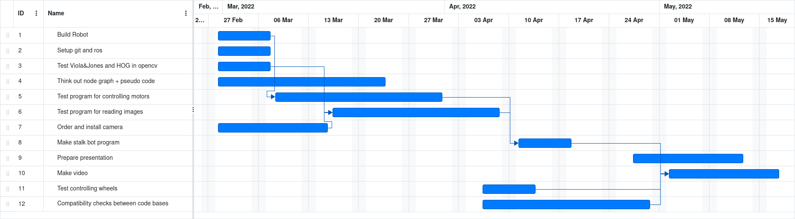
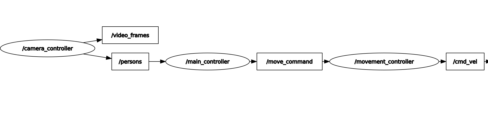

# stalk-bot

We set out to create a robot that can detect people in its field of vision, and then chase them only when they are not looking. This behaviour was inspired by the Weeping Angels from Doctor Who and the Boos from Mario. Because this makes it look like the robot is stalking people, we dubbed this project "stalk-bot".

Throughout the development it became clear that our method of detecting people was not robust enough to properly implement this behaviour, so instead the functionality shifted towards chasing people regardless of whether they were looking at the robot or not.

TODO explain how we detect people (short paragraph on CameraController, Viola&Jones and HOG)

TODO explain MainController and decision making

Finally, the `MovementController` node processes the top-level commands and publishes the corresponding message. For example, if the robot has to move forward then the linear velocity will have a positive x value. If it has to rotate then the angular velocity will have positive or negative z value. These values are combined into a `Twist` message (which is built-in to ROS) and are then published to the built-in `cmd_vel` topic, which will handle driving the motors. The speed of moving and rotating can be set separately in the `MovementController` node through class variables.

## Authors

- Jasper Govaerts
- Jente Driesen
- Kasper De Burghgraeve
- Milan Schepers
- Thomas Segaert - CEO
- William Dumez - CCO
- Yannick Saelen

## Planning

We used [this free online tool](https://www.onlinegantt.com/#/gantt) to make the planning.

## Trello

We used Trello to keep track of weekly tasks. You can use [this](https://l.messenger.com/l.php?u=https%3A%2F%2Ftrello.com%2Finvite%2Fb%2FQkdTKCNW%2Fafb660e5a34bca409ec5872ddadd8a15%2Fsee-angel-reaper&h=AT2c3liH4tApPf6vF7y0Qi7hXzygbg4yvLcawCJspPnR2KjIR9o0D7gD_35xUjHTYKHUeP-hmoa6xIr8warRBGQTGQ_0cBfCNw11fAAkOf_A4Bvl94JuEjb3T3zX4W1TP1ScKClaPWUcYw) link to view our board (an account is required).

## Node graph

This node graph was obtained using `rqt_graph` and shows our custom nodes and topics.

## Commands for working with ROS

### Build your entire workspace (execute in root of workspace)

`colcon build` 

### Build only select packages

`colcon build --packages-select <package_name>`

### Using ros commands requires sourcing in any terminal

`. install/setup.bash`

### Get a graphic representation of nodes and graphs

`rqt_graph`

### Get a terminal print of data cast be a certain topic

`ros2 topic echo <TOPIC>`

### Create a new package (execute in src folder)

`ros2 pkg create --build-type ament_python <package_name>`

### Run a node

You must first configure the entry point in the package's `setup.py` file.

`ros2 run <package_name> <entry_point>`

### run our launch file

This launch file has been configured to run all required nodes for our program.

`ros2 launch stalkbot_interface stalker.launch.py`

## Our Github workflow

(This was a short tutorial for those who had not used git & github before.)

### Creating new branches

The `main` branch contains only large releases of our code. If this was a big software project the main branch would be like the final release (v1.0, v1.1, ...). **Never branch from `main`!**

The `dev` branch contains smaller releases that eventually get bundled into a bigger release into main. This is like an internal release that is not yet ready to show to the public.

**All code committed to these two branches should work! (aside from unintentional bugs) so make sure to test your code before committing to them.**

Let's say you wanted to work on a new feature about testing the wheels. Here's what you should do:
1. Create a new branch **from `dev` or any other branch besides `main`**.
   You can do this in VS Code by pressing `ctrl+shift+P` and searching for `Git: Create Branch From...`
2. Give this branch a short but descriptive name. For example: `wheels` or something like that.
3. Make all your changes to this branch, and commit your code often but not constantly (see presentation).
4. When your feature is done, test all your code to make sure everything works and there are no obvious bugs.
5. Merge your new branch **into `dev`**. Do not merge it into `main`! (see merging branches)
6. (Optional) delete your `wheels` branch.
   
This way, the `main` branch will always be older than any other branch and it will be easier to see which branches contain which commits. The only time main will get updated, is when `dev` is merged into it.

### Merging branches

**Merging branch A into branch B** means that branch B will get updated to include changes that were made to A, **and not the other way around**. Let's say I had a branch named `wheels` that I wanted to merge into `dev`. I would do the following:

1. Make sure there are no uncommitted changes in `wheels`.
2. **Switch your active branch to `dev` and pull any changes from the repository**. VS Code: choose your branch in the bottom left corner of your screen and press the icon to the right of it.
3. `ctrl+shift+P` and search for `Git: Merge Branch...`
4. Select the `wheels` branch.
5. If the changes made in `wheels` do not conflict with the changes in `dev`, you're done.
6. If there are conflicts, then these are called merge conflicts and you will have to manually solve them by going into each conflicted file and choosing which changes to accept ('current changes' would be `dev`, while 'incoming changes' would be `wheels`). If you would like a mix of both changes in a file, you will have to edit it manually to include both the changes.
   Merge conflicts can be avoided by making good commits.

Now any commits I had made to `wheels` will be included in `dev`, and not the other way around. 

Also note that you can merge other branches into your branch at any time. For example, if someone else made a change to a file that you would also like, simply merge their branch into yours.